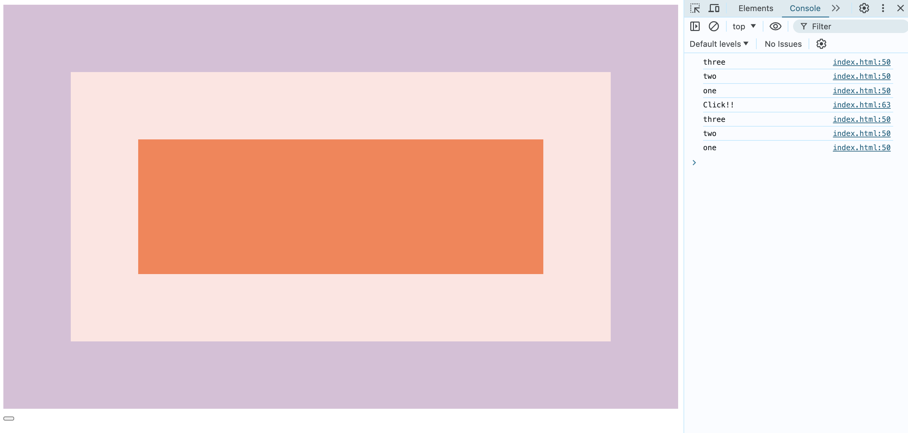

# Event-Capture-Propagation-Bubbling-and-Once

This is a 30-days javascript grinding  
js30 [https://github.com/ningh98/js30]  
25. Event-Capture-Propagation-Bubbling-and-Once [https://github.com/ningh98/Event-Capture-Propagation-Bubbling-and-Once]

## Table of contents

- [Overview](#overview)
  - [Screenshot](#screenshot)
- [My process](#my-process)
  - [Built with](#built-with)
  - [What I learned](#what-i-learned)


## Overview

The HTML document demonstrates the concept of event capture and bubbling in JavaScript. 

### Screenshot




## My process

### Built with

- HTML
- CSS
- Javascript


### What I learned


```js

const divs = document.querySelectorAll('div')
  const button = document.querySelector('button')
  function logText(e){
    
    console.log(this.classList.value)
    // e.stopPropagation() //stop bubbling
  }


  divs.forEach(div => div.addEventListener('click', logText,
    {
      capture: false,
      // once: true
    }
  ))

  button.addEventListener('click', () => {
    console.log('Click!!')
  }, {
    once: true
  })

```